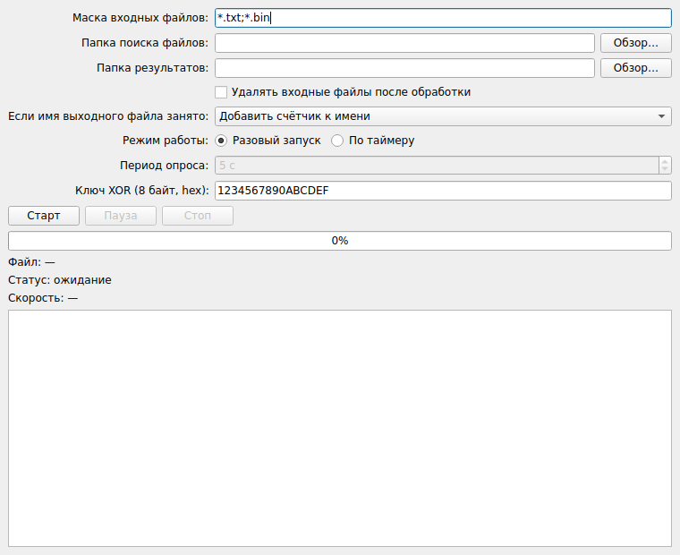

# XOR File Processor

Приложение на C++/Qt (Qt Widgets): модифицирует файлы побайтовой операцией
**XOR** с заданным 8-байтным ключом. Интерфейс не блокируется на больших
файлах (проверено на файлах в десятки ГБ), обработку можно ставить на паузу и
возобновлять, а закрытие корректно завершает работу даже во время обработки.



## Возможности (по пунктам задания)

| Пункт | Реализация |
|---|---|
| a) маска входных файлов | поле «Маска», несколько масок через `;` или пробел (`*.txt;testFile.bin`) |
| b) удалять входные файлы | флажок «Удалять входные файлы после обработки» |
| c) путь сохранения результатов | поле «Папка результатов» + «Обзор…» |
| d) путь поиска файлов | поле «Папка поиска файлов» + «Обзор…» |
| e) конфликт имён | выпадающий список: «Добавить счётчик к имени» / «Перезаписать» |
| f) режим работы | переключатель «Разовый запуск» / «По таймеру» |
| g) период опроса | поле «Период опроса», секунды (активно в режиме таймера) |
| h) 8-байтный ключ (hex) | поле «Ключ XOR», маска ввода на 16 hex-символов (`1234567890ABCDEF`) |

Дополнительно:

- **Неблокирующий интерфейс.** Обработка вынесена в отдельный поток
  (`FileProcessor` + `QThread`), файл читается и пишется блоками по 4 МБ, поэтому
  потребление памяти не зависит от размера файла — 10 ГБ обрабатываются так же,
  как мегабайтные.
- **Статус и прогресс.** Прогресс-бар в процентах, текущий файл, статус
  (Обработка / Пауза / Ожидание) и скорость в МБ/с.
- **Пауза и возобновление** в любой момент — обработка продолжается ровно с того
  места, где остановилась (позиция в файле и позиция в ключе сохраняются).
- **Корректное завершение.** При закрытии во время обработки программа
  запрашивает подтверждение, отменяет текущий файл, дожидается завершения потока
  и только затем выходит — «висящих» потоков не остаётся.
- **Безопасная запись.** Результат пишется во временный файл `*.part` и
  переименовывается в целевой только при полном успехе; отмена или сбой не
  оставляют частично обработанного файла под правильным именем.
- **Защита от разрушительной комбинации настроек.** Если папки входа и выхода
  совпадают при политике «Перезаписать», результат пишется поверх входного
  файла — тогда удаление входного файла заблокировано (иначе удалился бы и
  результат). Программа предупреждает об этом при старте.

## Сборка

Требуется Qt 5.15+ или Qt 6, компилятор с поддержкой C++17
(на Windows — MinGW из комплекта Qt).

### Qt Creator
Открыть `CMakeLists.txt` (или `xor-file-processor.pro`), выбрать комплект
MinGW и нажать «Собрать/Запустить».

### Командная строка (CMake)
```bash
cmake -S . -B build -DCMAKE_BUILD_TYPE=Release
cmake --build build
```

### Командная строка (qmake)
```bash
qmake && make        # Windows/MinGW: qmake && mingw32-make
```

## Как работает XOR

Ключ из поля h раскладывается в 8 байт, старший байт hex-значения — первый:
`1234567890ABCDEF` → `12 34 56 78 90 AB CD EF`. Каждый байт файла XOR-ится с
соответствующим байтом ключа по кругу: `out[i] = in[i] ^ key[i % 8]`. Операция
обратима — повторная обработка тем же ключом восстанавливает исходный файл.

## Проверка

Корректность проверялась на реальном классе `FileProcessor` (headless-запуск,
без GUI):

- полная обработка файла — результат совпадает с эталонным XOR, размер сохранён;
- обратимость — повторная обработка тем же ключом восстанавливает исходный файл;
- независимость от размера блока — ключ корректно продолжается через границы;
- пауза посреди файла и возобновление — результат идентичен непрерывной обработке;
- отмена — не остаётся временных `*.part`;
- политика счётчика имён — создаются `data.bin`, `data (1).bin`;
- файл нулевого размера — обрабатывается штатно;
- завершение потока во время паузы — поток останавливается за ~1 мс, без зависания;
- **файл 3 ГБ** (за границей 2^31): обработан полностью, прогресс корректен,
  **пиковая память процесса — 4 МБ**, то есть не зависит от размера файла.

## Структура проекта

```
xor-file-processor/
├── CMakeLists.txt          # сборка через CMake
├── xor-file-processor.pro  # сборка через qmake
├── README.md
├── screenshot.png
└── src/
    ├── main.cpp            # точка входа
    ├── MainWindow.h/.cpp   # форма, очередь файлов, режим таймера, управление
    └── FileProcessor.h/.cpp# обработчик (рабочий поток): XOR, пауза, отмена, прогресс
```
